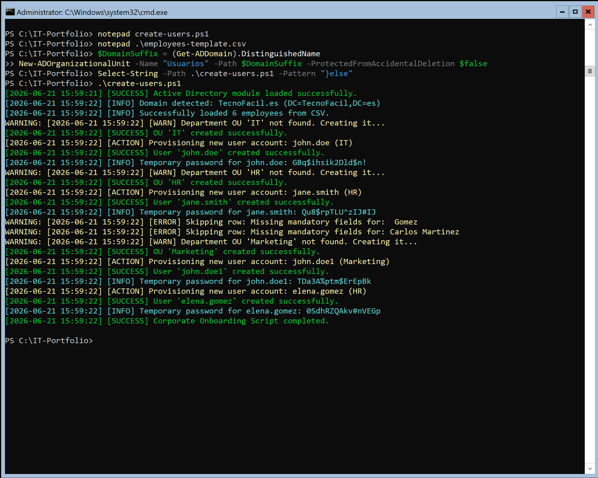
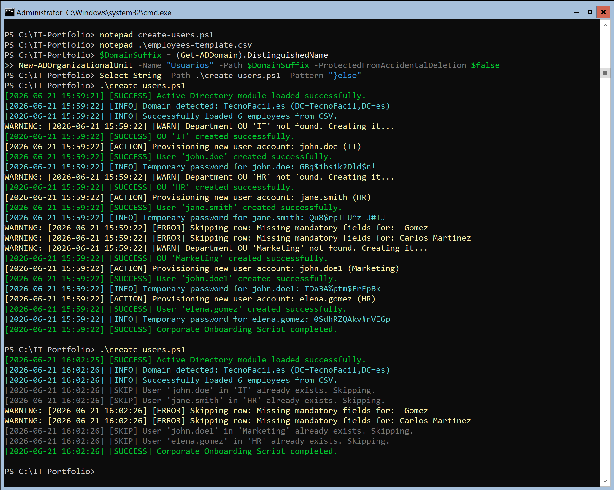
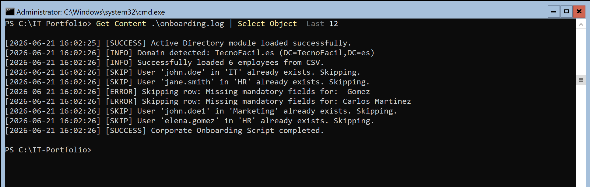
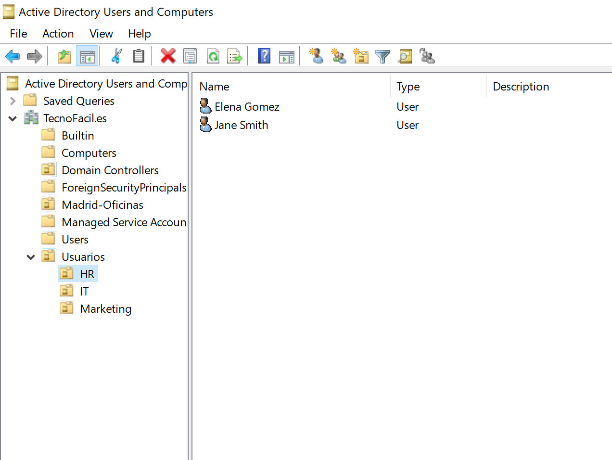

# Automated Corporate Onboarding System

A production-ready PowerShell solution that automates user provisioning in Active Directory environments. The script dynamically creates Organizational Units, generates cryptographically secure passwords, and handles the full onboarding lifecycle from a single CSV file — with strict idempotency and centralized audit logging.

---

## Screenshots

### Execution — New Users


### Idempotency — Re-run with no changes


### Audit Log


### Active Directory Structure after provisioning


---

## Key Features

- **Dynamic OU Creation** — Inspects the AD structure and automatically creates missing Department OUs on the fly.
- **Strict Idempotency** — Runs multiple times without duplicating accounts. Already-provisioned users are detected by Distinguished Name and safely skipped.
- **Cryptographically Secure Passwords** — Uses `RNGCryptoServiceProvider` (.NET) to generate unique 16-character temporary passwords at runtime. No hardcoded credentials. Enforces *"User must change password at next logon"*.
- **Smart Collision Handling** — Resolves naming conflicts (homonyms across departments) by incrementing the `sAMAccountName` and `DisplayName` dynamically while preserving idempotency.
- **Null-safe CSV Parsing** — Optional fields (`Title`, `Office`) default to empty string when absent, preventing runtime exceptions on incomplete data.
- **Auto Domain Detection** — Queries `Get-ADDomain` at runtime to resolve the domain DN and UPN suffix. No hardcoded domain values — runs in any AD environment without code changes.
- **Centralized Audit Logging** — Every state change, skip, warning, and error is written to `onboarding.log` with timestamps and severity levels. Color-coded console output for live feedback.
- **Graceful Error Handling** — All AD write operations (`New-ADOrganizationalUnit`, `New-ADUser`) are wrapped in `try/catch`. A failure on one user or OU does not abort the entire batch.

---

## System Requirements

| Requirement | Detail |
|---|---|
| Operating System | Windows Server 2025 / 2022 / 2019 / 2016 / 2012 R2 |
| PowerShell | 5.1 or later (PS 7 compatible) |
| Module | `ActiveDirectory` (native on DCs, or via RSAT on workstations) |
| Permissions | Account running the script must have rights to create OUs and Users in AD |

> Tested on Windows Server 2022 Core and Windows 10 with RSAT.

---

## Repository Structure

```
active-directory-onboarding/
├── create-users.ps1
├── employees-template.csv
├── .gitignore
├── README.md
└── docs/
    └── screenshots/
        ├── 01-execution-new-users.png      
        ├── 02-idempotency-skip.png         
        ├── 03-audit-log.png                
        └── 04-ad-structure.png             
```

---

## How to Use

**1. Clone the repository**
```bash
git clone https://github.com/ricardolealpi/windows-server-automation.git
cd windows-server-automation/active-directory-onboarding
```

**2. Populate the CSV with your employees**

Edit `employees-template.csv` following the existing structure. `Title` and `Office` are optional — the script handles empty values safely.

```csv
FirstName,LastName,Department,Title,Office
John,Doe,IT,Systems Administrator,Madrid
Jane,Smith,HR,HR Manager,Murcia
Carlos,Martínez,Finance,Financial Analyst,Barcelona
```

**3. Run the script as Administrator on a Domain Controller or RSAT machine**
```powershell
# Open PowerShell as Administrator, then:
Set-ExecutionPolicy RemoteSigned -Scope Process
.\create-users.ps1
```

The script will:
- Auto-detect the domain
- Create missing Department OUs under `OU=Usuarios`
- Provision each user with a unique secure password
- Log every action to `onboarding.log`

**4. Review the audit log**
```powershell
Get-Content .\onboarding.log
```

> **Security note:** `onboarding.log` contains plaintext temporary passwords for IT handoff. It is excluded from version control via `.gitignore`. In regulated environments, replace with a secure delivery channel (Azure Key Vault, Microsoft Graph encrypted email, or a PAW clipboard).

---

## Architecture Notes

This project demonstrates core competencies required for modern hybrid cloud environments:

- **No hardcoding** — Domain roots, paths, and suffixes are fully parameterized at runtime via `Get-ADDomain`.
- **Defensive programming** — `try/catch` blocks on every AD write operation ensure partial failures never kill the full batch.
- **The bridge to the cloud** — Mastering on-premises AD identity automation is the foundation for synchronizing directory structures to Microsoft Entra ID via Entra Connect. The same provisioning logic that runs here can be extended to call the Microsoft Graph API for cloud-native user creation.
- **Roadmap** — Next iteration targets Entra ID (Azure AD) provisioning via `Microsoft.Graph` PowerShell module, removing the dependency on on-premises AD entirely for hybrid and cloud-only environments.

---

<details>
<summary>🌐 <b>Versión en Español</b></summary>
<br>

# Sistema de Incorporación Corporativa Automatizada

Una solución PowerShell lista para producción que automatiza el aprovisionamiento de usuarios en entornos de Active Directory. El script crea dinámicamente Unidades Organizativas, genera contraseñas criptográficamente seguras y gestiona el ciclo completo de incorporación desde un único archivo CSV, con idempotencia estricta y registro de auditoría centralizado.

---

## Características Clave

- **Creación Dinámica de OUs** — Inspecciona la estructura de AD y crea automáticamente las OUs de departamento que falten.
- **Idempotencia Estricta** — Se puede ejecutar múltiples veces sin duplicar cuentas. Los usuarios ya aprovisionados se detectan por Distinguished Name y se omiten de forma segura.
- **Contraseñas Criptográficamente Seguras** — Usa `RNGCryptoServiceProvider` (.NET) para generar contraseñas temporales únicas de 16 caracteres en tiempo de ejecución. Sin credenciales escritas en el código. Aplica la política *"El usuario debe cambiar la contraseña en el próximo inicio de sesión"*.
- **Gestión Inteligente de Colisiones** — Resuelve conflictos de nombres (homónimos en distintos departamentos) incrementando dinámicamente el `sAMAccountName` y el `DisplayName`.
- **Parseo CSV Seguro ante Nulos** — Los campos opcionales (`Title`, `Office`) toman valor vacío si están ausentes, evitando excepciones en tiempo de ejecución.
- **Auto-detección del Dominio** — Consulta `Get-ADDomain` en tiempo de ejecución. Sin valores de dominio escritos en el código — funciona en cualquier entorno AD sin modificaciones.
- **Registro de Auditoría Centralizado** — Cada cambio de estado, omisión, advertencia y error queda registrado en `onboarding.log` con marca de tiempo y nivel de severidad.
- **Manejo de Errores Robusto** — Todas las operaciones de escritura en AD están envueltas en `try/catch`. Un fallo en un usuario o OU no aborta el lote completo.

---

## Cómo Usarlo

**1. Clonar el repositorio**
```bash
git clone https://github.com/ricardolealpi/windows-server-automation.git
cd windows-server-automation/active-directory-onboarding
```

**2. Rellenar el CSV con los empleados**

Edita `employees-template.csv` siguiendo la estructura existente. `Title` y `Office` son opcionales.

**3. Ejecutar el script como Administrador en un DC o máquina con RSAT**
```powershell
Set-ExecutionPolicy RemoteSigned -Scope Process
.\create-users.ps1
```

**4. Revisar el log de auditoría**
```powershell
Get-Content .\onboarding.log
```

---

## Notas de Arquitectura

- **Sin hardcoding** — Las rutas y sufijos de dominio se resuelven en tiempo de ejecución mediante `Get-ADDomain`.
- **Programación defensiva** — Bloques `try/catch` en cada operación de escritura AD garantizan que los fallos parciales no interrumpan el lote completo.
- **El puente hacia la nube** — Dominar la automatización de identidades en AD local es el requisito previo para sincronizar estructuras hacia Microsoft Entra ID mediante Entra Connect. La misma lógica de aprovisionamiento puede extenderse para llamar a Microsoft Graph API para la creación de usuarios nativamente en la nube.
- **Hoja de ruta** — La siguiente iteración apunta al aprovisionamiento en Entra ID (Azure AD) mediante el módulo PowerShell `Microsoft.Graph`, eliminando la dependencia del AD local para entornos híbridos y cloud-only.

</details>
